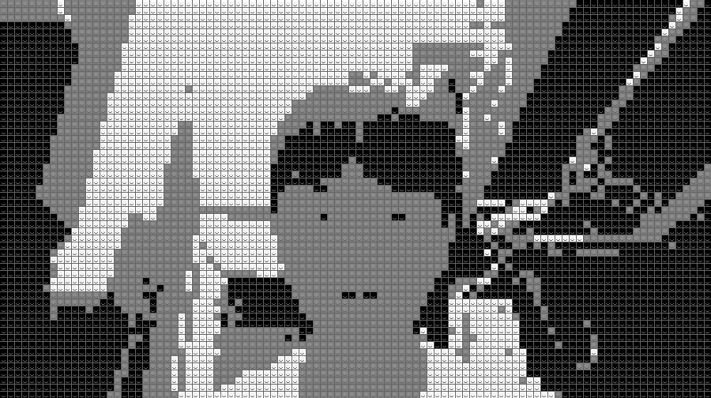
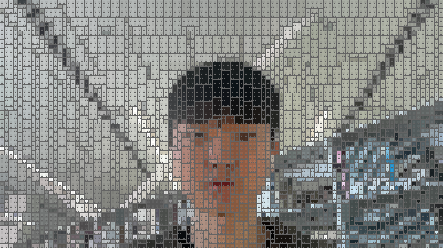

# 🧱 LEGO-Style Image Generator

Transform images and live camera input into LEGO-style renderings using grid-based tiling, adaptive color merging, and heuristic optimization.

This project focuses on building a structured and explainable pipeline rather than achieving perfect visual realism.

---

## 📸 Results

### Quantized Output


### Final Lego-Style Output

---

## ✨ Features

- Convert images into LEGO-style representations
- Support both grayscale (3-color) and full RGB modes
- Multiple brick sizes (1x1, 1x2, 2x2, 2x4, etc.)
- Greedy tiling algorithm for efficient brick placement
- Adaptive color merging based on color similarity
- Stud and shadow rendering for 3D visual effect
- Brick summary (total count and per type)
- Real-time camera processing

---

## 🏗 Pipeline Overview

The system is designed as a modular pipeline:

1. **Input & Preprocessing**
   - Load image or capture from camera
   - Resize to a bounded grid (≤ 100×100)

2. **Grid Representation**
   - Each grid cell represents one potential LEGO unit

3. **Color Processing**
   - Task 2: grayscale + 3-level quantization
   - Task 3: adaptive color merging during brick placement

4. **Brick Placement**
   - Largest-first greedy tiling
   - Boundary and color similarity checks
   - Occupied grid tracking

5. **Rendering**
   - Brick-level drawing
   - Stud generation with brightness adjustment
   - Shadow rendering using layered ellipses

6. **Brick Summary**
   - Count total bricks
   - Track usage of each brick type

---

## 🧠 Key Ideas

- **Grid-based discretization** for stable computation
- **Greedy tiling** instead of expensive global optimization
- **Region-based color merging** rather than fixed quantization
- **Deterministic pipeline** suitable for real-time use

---

## ⚙️ Algorithm Details

### Color Similarity

Color similarity is measured using Manhattan distance:

```

D = |R1 - R2| + |G1 - G2| + |B1 - B2|

````

Pixels within a threshold are grouped into the same brick.

---

### Greedy Brick Placement

- Iterate from top-left to bottom-right
- Try largest bricks first
- Place if:
  - Within boundary
  - Color is consistent
  - Region is not occupied

---

## 🎥 Real-Time Mode

Supports live camera input using OpenCV:

- Press **s** to save a frame
- Press **q** to quit

---

## 🚀 Run

### Camera Mode

```bash
lego-style-transform.py
```

---

## 📊 Example Output (Brick Summary)

```
Total bricks: 4377
1x1 : 1704
1x2 : 504
2x1 : 1506
2x2 : 257
2x4 : 147
4x2 : 259
```

---

## 📌 Notes

* The system prioritizes structural consistency and interpretability
* Visual quality depends on threshold tuning
* Larger bricks improve efficiency but may reduce detail

---
